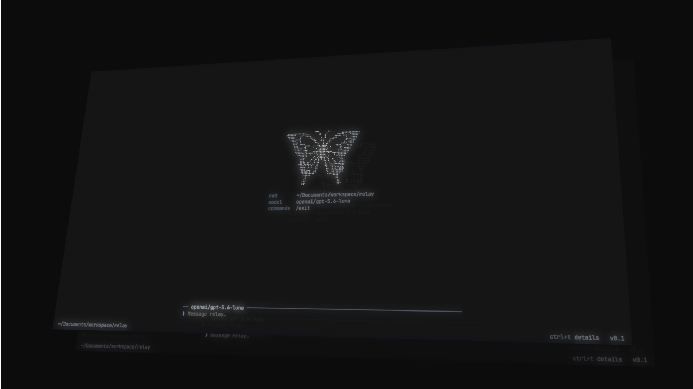

<p align="center">
  
</p>

# Relay

An open-sourced AI coding agent, a terminal-based assistant that can read your code, call tools, and help you build.

> [!WARNING]
> **Work in progress.** The agent loop, tool calling, and terminal UI work end to end, but there is **no approval flow yet**. The interactive TUI auto-approves every tool, so Relay can change files and run commands without asking, use it in a directory you don't mind it touching.


## Getting started

```bash
# 1. Install dependencies
python -m venv .venv
source .venv/bin/activate
pip install -r requirements.txt

# 2. Log in (opens your browser to authorize with OpenRouter)
python main.py login

# 3. Run it
python main.py                 # interactive mode
python main.py "your prompt"   # single-shot mode
python main.py --cwd /path     # run against a different working directory
```

## License

[GNU GENERAL PUBLIC LICENSE](LICENSE)
