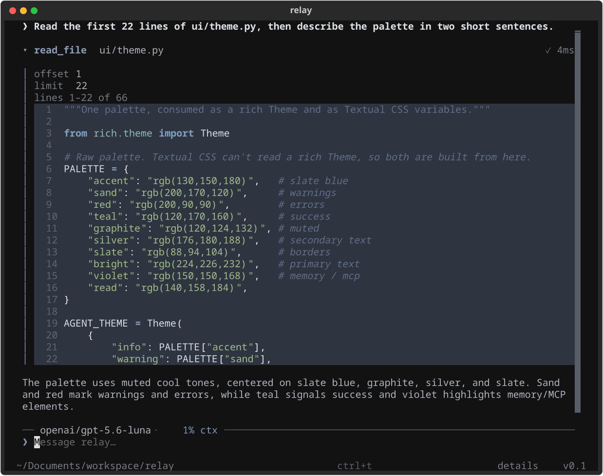

<p align="center">
  
</p>

# Relay

An open-sourced AI coding agent, a terminal-based assistant that can read your code, call tools, and (eventually) help you build.

> [!WARNING]
> **Work in progress.** The agent loop, tool calling, and the terminal UI now work end to end. There is **no approval flow yet**: while it's being built, the interactive TUI **auto-approves every tool**, including mutating ones (`write_file`, `edit`, `shell`). That means Relay can change your files and run commands without asking — use it in a directory you don't mind it touching. This is not an MVP yet, and the README will be updated as things progress.

<p align="center">
  
</p>

## What works today

- **Interactive TUI** — a full-screen [Textual](https://textual.textualize.io/) app: streaming responses, collapsible tool calls that re-render in place, syntax-highlighted file reads and diffs, and a graphite-ink theme. Press `ctrl+t` to fold or unfold every tool call at once.
- **One-shot mode** — `python main.py "your prompt"` prints line-oriented output to normal scrollback, so it pipes and redirects cleanly.
- **Direct LLM chat** — streaming chat completions through an OpenAI-compatible endpoint (currently OpenRouter).
- **Browser login** — `relay login` authorizes with OpenRouter over an OAuth PKCE flow (no client secret), mints a user-scoped API key, and saves it locally so you never have to paste a raw key. `relay login --paste` and `relay logout` are also there.
- **Tool calling** — the agent loop requests tools and feeds the results back into the conversation. Four core tools are wired up: `read_file`, `write_file`, `edit`, and `shell`.
- **Context usage** — the rule above the input box shows the model and how much of the context window the last turn used.
- **Config system** — layered TOML config (system + per-project), with environment variables for secrets.

### Tool approval

Tools are tagged with a `ToolKind`. Anything that isn't a plain read (`write`, `shell`, `network`, `memory`) counts as mutating, and the agent routes it through a confirmation handler before it runs:

- **One-shot mode** asks on stdin (`Allow this tool? [y/N]`).
- **The interactive TUI has no approval UI yet.** As a stopgap, its handler is hardcoded to approve everything (`return True`) so mutating tools actually run while the real flow is being built. The handler can't just be `None` — the agent reads a missing handler as a denial, so nothing mutating would ever execute.

A real approval flow in the TUI (an inline prompt, and an `/approval` command) is being built next, at which point this stopgap goes away.

## Getting started

```bash
# 1. Install dependencies
python -m venv .venv
source .venv/bin/activate
pip install -r requirements.txt

# 2. Log in (opens your browser to authorize with OpenRouter)
python main.py login

# 3. Run it
python main.py                 # interactive mode
python main.py "your prompt"   # single-shot mode
python main.py --cwd /path     # run against a different working directory
```

Inside the TUI: `ctrl+t` toggles tool detail, `enter` on a focused tool row expands just that one, and `/exit`, `/quit`, or `ctrl+c` leave.

## Authentication

Relay needs an OpenRouter API key. There are two ways to provide one, in order of precedence:

1. **`API_KEY` environment variable** — always wins when set, which is handy for CI or one-off overrides:
   ```bash
   export API_KEY="your-api-key"
   export BASE_URL="https://openrouter.ai/api/v1"   # optional; defaults to OpenRouter
   ```
2. **`relay login`** — the everyday path. It runs an [OAuth PKCE](https://openrouter.ai/docs/use-cases/oauth-pkce) flow:

   ```bash
   python main.py login              # authorize in the browser
   python main.py login --paste      # paste an API key manually instead
   python main.py login --base-url … # save a non-default API base URL
   python main.py logout             # remove the saved key
   ```

   `login` opens your browser to `openrouter.ai/auth`, waits on a one-shot `localhost` callback for the authorization code, then exchanges it (plus the PKCE verifier) for a fresh user-scoped key. No client secret is involved. If no browser can be launched, it prints the URL for you to open manually.

The key is written to `credentials.toml` in your user config dir (locked to `0600`), **not** to `config.toml` — secrets don't belong in a file you might commit or share. `relay logout` deletes it.

## Configuration

Relay reads config from two locations, merged in order (later wins):

1. **System:** `~/.config/relay/config.toml`
2. **Project:** `.relay/config.toml` in your working directory

```toml
max_turns = 100
max_tool_output_tokens = 50000
debug = false

[model]
name = "openai/gpt-5.6-luna"
temperature = 1.0
context_window = 256000
```

`api_key` and `base_url` are **not** stored in `config.toml` — they come from the `API_KEY` / `BASE_URL` environment variables or from the separate `credentials.toml` written by `relay login`. See [Authentication](#authentication).

An `AGENTS.md` in your working directory is picked up automatically as developer instructions.

## Project structure

```
main.py            # CLI entrypoint (Click) + one-shot driver
agent/             # agentic loop and event types
client/            # LLM client + streaming/response models
context/           # conversation/context management
config/            # config schema, layered loader, credentials + OAuth login
tools/             # tool base class, registry, and core tools
prompts/           # system prompt
ui/                # Textual app (app.py), one-shot renderer, theme, logo
utils/             # errors, paths, text/token helpers
```

## Roadmap

| Area   | Status         |
| ------ | ------------   |
| Config | ✅ Done        |
| UI     | ✅ Done        |
| Tools  | 🚧 Unfinished  |
| Tool approval | 🚧 One-shot only; TUI auto-approves |
| MCP(s) | ❌ Not Started |
| Subagents | ❌ Not Started |
| Agent Swarms | ❌ Not Started |
| Planning | ❌ Not Started |
| Memory Management | ❌ Not Started |
| Session Managment | ❌ Not Started |
| Command Handling /slash commands | ❌ Not Started |
| Git Integration | ❌ Not Started | 

### Ideas / things to build

- **Tool approval in the TUI** — an inline approval prompt (and an `/approval` command) so destructive tools ask instead of being refused outright.
- **More core tools** — `list_dir`, `grep`/search, and a `shell`/bash tool.
- **Context management** — token-budget-aware truncation, conversation compaction/summarization when the window fills up.
- **Subagents** — spawn scoped sub-agents for parallel or isolated tasks (e.g. a read-only "explore" agent for search).
- **Multi-turn tool loop hardening** — retries, error surfacing, and streaming tool output.
- **MCP support** — connect external tools via the Model Context Protocol (the theme already reserves a `tool.mcp` style).
- **Persistent history** — swap the in-memory prompt history for on-disk history across sessions.
- **Slash-command autocomplete** — completion for `/help`, `/model`, etc. in the input box.
- **Session persistence** — save/resume conversations.
- **Cost/token usage display** — surface prompt/completion token counts per turn, not just context percentage.

## License

GNU GENERAL PUBLIC LICENSE
